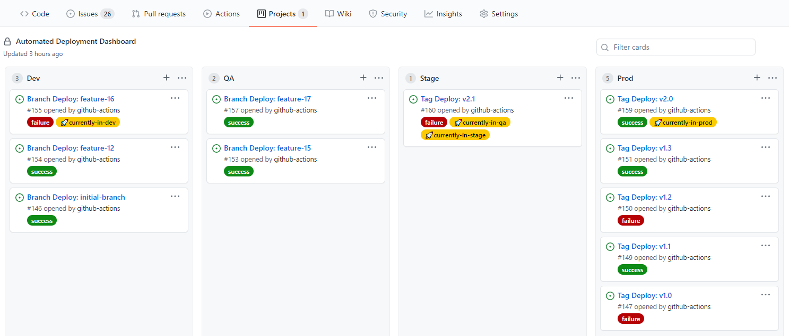
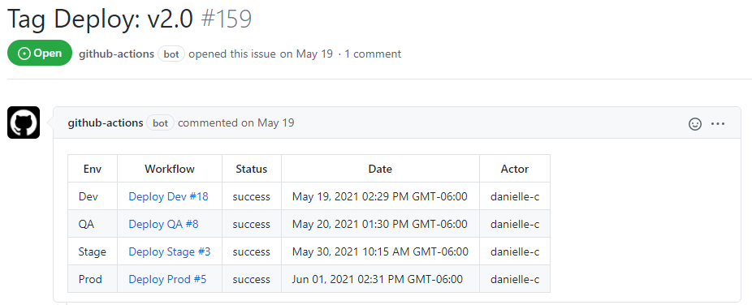

# update-deployment-board

This action creates a visual representation of deployments on a Project board in your GitHub repository.  When this action is included in a workflow that does a deployment it will generate or update an existing issue and include it on the specified project board.  

## Index

- [Project Board](#project-board)
- [Action Conventions](#action-conventions)
- [Inputs](#inputs)
- [Example](#example)
- [Contributing](#contributing)
  - [Recompiling](#recompiling)
  - [Incrementing the Version](#incrementing-the-version)
- [Code of Conduct](#code-of-conduct)
- [License](#license)
  
<kbd></img></kbd>

When the action runs it will label the issue with three labels
  1. `🚀currently-in-<dev|qa|stage|prod|other-provided-env>` 
     - This label makes it visually easy to see which branch, tag or SHA was most recently deployed to a specific environment and it is meant to stay with the card representing code that is currently deployed to that environment.  
     - In the screenshot above, the issue for `Tag Deploy: v2.1` has the labels for `🚀currently-in-qa` and `🚀currently-in-stage` because that code is deployed to both environments.  The label will stay on a card even if it moves to another column until a different branch, tag or SHA is deployed to that environment.
  2. Deployment Status `success|failure|skipped|cancelled`. 
     - The status matches the possible values for step outcomes and this cannot be changed.
  3. Default Label `deployment-board`.
     - This label is used to filter out these labels in the Github Issues UI

The issue will contain a list of deployments for the ref which include the environment, a link to the workflow run, the status, date of deployment and the actor who kicked off the workflow.  
<kbd></img></kbd>


## Project Board
Before using this action, a Project board must be set up.
- The board will need one column per environment and the name should match the environments you will provide with the action.
  - If the columns don't exist or don't match the environment name used with the action, it will fail.
- The board on this repository can be cloned by opening [the board], opening the `≡ Menu`, clicking on the `...` then selecting `Copy`.
  - Chose a new Owner by typing in the owner/repository you want to add the board to.
  - Update the board name and description if desired.
  - Once the board has been copied over update, delete or add columns as necessary.

If the repository has multiple deployable artifacts, like a database and app service, the recommended approach is to create separate boards for each deployable type.

Some repositories that contain multiple deployable artifacts may need to customize the behavior of the action.  For repos where one release tag is created but the deployments for each item happen separately there is a `deployable-type` argument.  This allows you to specify the type (*like MFE, API, SVC, BFF, DB, etc*) and separate issues are created for each deployable on the project board.  This can make tracking of separate deployable artifacts in the same repository easier.

## Action Conventions
- This action can be used in conjunction with [cleanup-deployment-board] so the project board only shows the most current items.
- The issues and cards on the Automated Deployment board are intended to be handled by this action and the [cleanup-deployment-board] action only.  Modifying any of the issues or cards that back the project board may result in unexpected results.
  - The cleanup action relies on modified dates to determine which cards should be kept.  If issues are manually modified the cleanup might close unexpected items.
  - The cleanup action searches for Deployment Issues and finds the project card for the respective issue.  If issues are closed manually the corresponding card won't be cleaned up.  
- The action assumes the repository where issues are created and updated is the repository where the action is run.
- The action will check to see if certain labels exist in the repository and create them if they don't.
- When an issue is generated a comment is added tagging the GitHub login responsible for creating that issue, this defaults to `@github-actions` unless another login is specified.  The intent of this comment is to cut down on the number of issues and data the action has to process when looking for an existing issue to update.  
- The action will only look through the last 100 issues that meet its search criteria to find what it needs.
- Using `continue-on-error: 'true'` may be helpful for this step since you might not want the job or workflow to fail if the board did not update correctly.
- When the `ref-type` argument is not provided the action will do some regex pattern matching to try to find the right ref type.  It will check in this order:
  - SHA: `/\b([0-9a-f]{40})\b/g`
     - Matches - a full SHA from your git commit
  - Tag: `/^(v?\d+(?:\.\d+)*.*)$/g`
     - Matches:
       - v1, v1.0, v1.0.0, v1.0.0-test1
       - 2, 2.0, 2.0.0, 2.0.0-test2
  - Branch: Default when the SHA or Tag pattern do not match
- Workflows with `success` or `failure` deploy status
  - An issue will be created in the appropriate environment column on the project board if one does not exist.
  - If there is an existing issue representing this deploy, it will be moved to the appropriate environment column on the project board.
  - The `🚀currently-in-<env>` label will be removed from the issue that currently has it (if there is one) and put the label on the issue representing this deploy.
- Workflows with `cancelled` or `skipped` deploy status
  - An issue will be created in the appropriate environment column on the project board if one does not exist.
  - If there is an existing issue representing this deploy, it will not be moved from the column it is currently in.
  - The `🚀currently-in-<env>` label will remain on the issue that had it before the workflow ran (if there is one).
    

## Inputs
| Parameter         | Is Required | Description                                                                                                                                                                                                                                                                                                                                                                                          |
| ----------------- | ----------- | ---------------------------------------------------------------------------------------------------------------------------------------------------------------------------------------------------------------------------------------------------------------------------------------------------------------------------------------------------------------------------------------------------- |
| `github-token`    | true        | A token with permissions to create and update issues.                                                                                                                                                                                                                                                                                                                                                |
| `github-login`    | false       | The login associated with the github-token.  Defaults to github-actions but should be updated if a different account owns the token provided.                                                                                                                                                                                                                                                        |
| `environment`     | true        | The environment the branch, tag or SHA was deployed to.                                                                                                                                                                                                                                                                                                                                              |
| `board-number`    | true        | The number of the project board that will be updated.  Can be found by using the number in the board's url. <br/><br/> For example the number would be 1 for:<br/>https://github.com/im-open/update-deployment-board/projects/1.                                                                                                                                                                     |
| `ref`             | true        | The branch, tag or SHA that was deployed.                                                                                                                                                                                                                                                                                                                                                            |
| `ref-type`        | false       | The type of ref that was deployed.  If not provided the action will use some regex patterns to try to identify the type.  <br/><br/>Possible Values: *branch, tag, sha*                                                                                                                                                                                                                              |
| `deployable-type` | false       | String indicating the type of deployable item (*like API, BFF, MFE, SVC, DB, etc*).<br/><br/>In repositories with multiple deployable artifacts that are deployed separately but use the same release number this arg is the mechanism for creating separate issues to track the deployment of each separate type.<br/><br/>  When provided, this will be added to the beginning of the issue title. |
| `deploy-status`   | true        | The status of the deployment.  <br/><br/>Possible Values: *success, failure, cancelled, skipped*                                                                                                                                                                                                                                                                                                     |
| `timezone`        | false       | IANA time zone name (e.g. America/Denver) to display dates in.  If time zone is not provided, dates will be shown in UTC                                                                                                                                                                                                                                                                             |


## Example

```yml
name: Manually Deploy to QA
on:
  workflow_dispatch:
    inputs:
      branchTagOrSha:
        description: 'The branch, tag or sha to deploy '
        required: false

jobs:
  environment: 'QA'
  deploy-different-ways:
    runs-on: [ubuntu-20.04]
    steps:
      - uses: actions/checkout@v2

      - id: deploy-to-qa
        continue-on-error: true  #Setting to true so the deployment board can be updated, even if this fails
        run: |
          ./deploy-to-qa.sh
        
        # Defaults to using github-actions for the login, regex matching to determine the ref-type and times shown in UTC
      - name: Update deployment board with Defaults
        id: defaults
        continue-on-error: true                             # Setting to true so the job doesn't fail if updating the board fails.
        uses: im-open/update-deployment-board@v1.3.8
        with:
          github-token: ${{ secrets.GITHUB_TOKEN}}          # If a different token is used, update github-login with the corresponding account
          environment: 'QA'
          board-number: 1
          ref: ${{ github.event.inputs.branchTagOrSha }}
          deploy-status: ${{ steps.deploy-to-qa.outcome }}  # outcome is the result of the step before continue-on-error is applied
      
      - name: Update deployment board with all values provided
        id: provided
        continue-on-error: true                             # Setting to true so the job doesn't fail if updating the board fails.
        uses: im-open/update-deployment-board@v1.3.8
        with:
          github-token: ${{ secrets.BOT_TOKEN}}             # Since a different token is used, the github-login should be set to the corresponding acct
          github-login: 'my-bot'
          environment: 'QA'
          board-number: 1
          ref: 'feature-branch-16'
          ref-type: 'branch' 
          deploy-status: ${{ steps.deploy-to-qa.outcome }}  # outcome is the result of the step before continue-on-error is applied
          timezone: 'america/denver'
      
      - name: Now Fail the job if the deploy step failed 
        if: steps.deploy-to-qa.outcome == 'failure' 
        run: exit 1
```

## Contributing

When creating new PRs please ensure:
1. The action has been recompiled.  See the [Recompiling](#recompiling) section below for more details.
2. For major or minor changes, at least one of the commit messages contains the appropriate `+semver:` keywords listed under [Incrementing the Version](#incrementing-the-version).
3. The `README.md` example has been updated with the new version.  See [Incrementing the Version](#incrementing-the-version).
4. The action code does not contain sensitive information.

### Recompiling

If changes are made to the action's code in this repository, or its dependencies, you will need to re-compile the action.

```sh
# Installs dependencies and bundles the code
npm run build

# Bundle the code (if dependencies are already installed)
npm run bundle
```

These commands utilize [esbuild](https://esbuild.github.io/getting-started/#bundling-for-node) to bundle the action and
its dependencies into a single file located in the `dist` folder.

### Incrementing the Version

This action uses [git-version-lite] to examine commit messages to determine whether to perform a major, minor or patch increment on merge.  The following table provides the fragment that should be included in a commit message to active different increment strategies.
| Increment Type | Commit Message Fragment                     |
| -------------- | ------------------------------------------- |
| major          | +semver:breaking                            |
| major          | +semver:major                               |
| minor          | +semver:feature                             |
| minor          | +semver:minor                               |
| patch          | *default increment type, no comment needed* |

## Code of Conduct

This project has adopted the [im-open's Code of Conduct](https://github.com/im-open/.github/blob/master/CODE_OF_CONDUCT.md).

## License

Copyright &copy; 2021, Extend Health, LLC. Code released under the [MIT license](LICENSE).

[git-version-lite]: https://github.com/im-open/git-version-lite
[the board]: https://github.com/im-open/update-deployment-board/projects/1
[cleanup-deployment-board]: https://github.com/im-open/cleanup-deployment-board